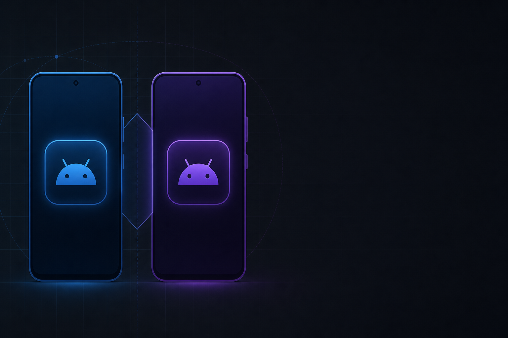
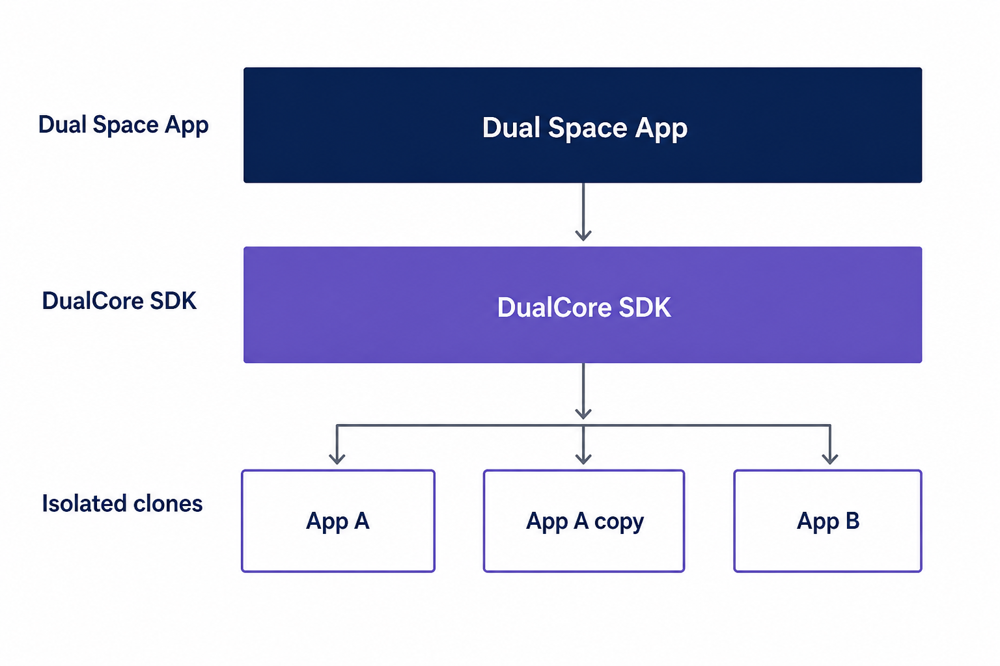
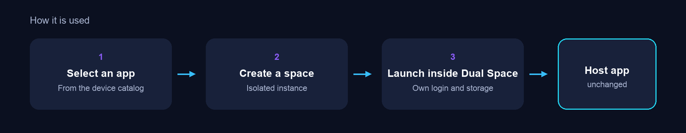
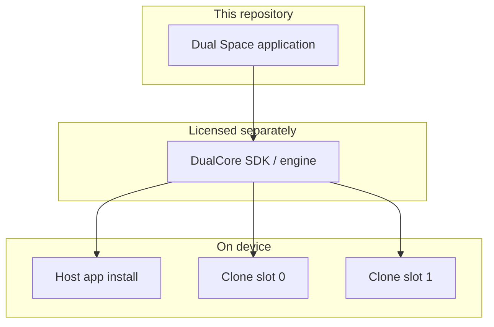

# Dual Space

<p align="center">
  
</p>

Dual Space is an Android application virtualization product. It runs supported apps in an isolated environment on the same device, so another instance can keep its own data, accounts, and settings without changing the original install.

This repository is the **Dual Space client / demo application**: the product UI and the integration surface. The virtualization runtime — **DualCore** — is a separate SDK. DualCore source is not published here. Organizations that need the engine, ongoing compatibility work, or commercial support can license DualCore independently.

**[Download the latest APK](https://github.com/mansoorulhaq166/Dual-Space-App/releases)** · Install on a compatible Android device · Open Dual Space

---

## What it is for

- Separate logins of the same app (for example messaging or social).
- Personal vs secondary data on one phone.
- Isolated copies for trying an app without mixing it with the host install.
- Running the clone inside Dual Space rather than as a second system-installed copy of the same package.

Not every Play app will clone. Apps that use Play integrity, heavy native code, or vendor-only APIs may need DualCore compatibility work.

---

## What the Dual Space app actually does

These are features in the Dual Space application you can download and tap through — not a separate published API.

| Area | In the app |
| --- | --- |
| Clone | Add a supported app from the device catalog and run it inside Dual Space |
| Isolation | Each clone has its own DualCore user slot, so data and accounts stay off the host install |
| Multiple copies | **Clone again** creates another instance of the same app. **Full** builds cap at **five** copies per package (slots 0–4); **Lite** builds cap at **two** (dual-account). The home grid shows a badge on copies after the first |
| Launch | Open a clone from Dual Space or a home-screen shortcut |
| Manage | Stop processes, clear that clone’s data, remove the clone, rename/hide/favorite |
| Spaces | PIN lock and a Private Space list for hidden clones (not Android’s work-profile Users UI) |
| Host | The original app on the phone is left as-is |

Compatibility rules for difficult guest apps live in DualCore, not as a settings screen in Dual Space.

---

## Architecture

Dual Space is two layers. Only the top layer lives in this GitHub repository.

<p align="center">
  
</p>

**Dual Space application (this repo)**  
Pick apps to clone, launch them, stop or remove them, and manage isolated copies of the same package (five in Full, two in Lite).

**DualCore (separate SDK)**  
The Android virtualization runtime: processes, storage, permissions, lifecycle, and guest-app compatibility. Distributed as an SDK, not as a complete public source tree.

<p align="center">
  
</p>



Cloning this repository alone does **not** produce a full Dual Space system. A working product build requires DualCore.

---

## DualCore SDK and commercial support

DualCore is the component that actually virtualizes applications. It is maintained independently and offered as a commercial SDK plus support.

Typical engagements:

- DualCore SDK license for embedding virtualization in your own Android product
- Integration support for the Dual Space demo / client pattern
- Compatibility work for specific guest apps or Android versions
- Updates, diagnostics, and runtime-rule support

**To license DualCore or buy support**, email **[m.techsolutions130@gmail.com](mailto:m.techsolutions130@gmail.com)**. Include your product, target Android versions, and which apps you need to virtualize.

You can also open a GitHub Issue titled `DualCore SDK / support`.

---

## Product flavors (Full / Lite)

Two side-by-side installable APKs (same DualCore + ABIs; Lite caps clones at two):

| Variant | applicationId | Clone cap |
| --- | --- | --- |
| `full` | `com.example.dual.space` | 5 |
| `lite` | `com.example.dual.space.lite` | 2 |

```bash
./gradlew :app:assembleFullRelease
./gradlew :app:assembleLiteRelease
./gradlew :app:assembleDebug   # defaults to fullDebug
```

## Demo scope

Treat this tree as a **reference client**: instance add/launch/stop/remove and extra copies of the same app (Full up to five, Lite up to two). It is not DualCore internals, native libraries, or a public management SDK.

---

## Compatibility

Intended for modern Android devices. Behavior is improved over time through DualCore updates and per-app runtime rules. There is no guarantee that every Play app will clone cleanly on every OEM skin.

---

## Disclaimer

Dual Space is an independent virtualization project. Apps you run inside it remain under their own licenses, terms of service, and platform rules. Functionality varies by app and Android version. Sideloaded APKs may be flagged by Play Protect; that is expected for this class of software when it is not distributed through Google Play.
